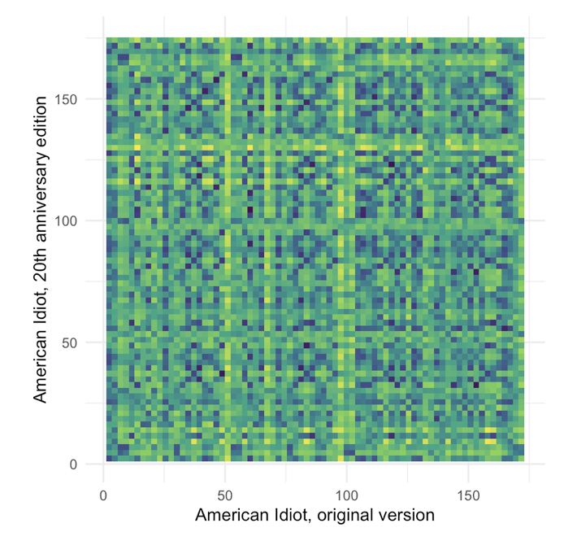
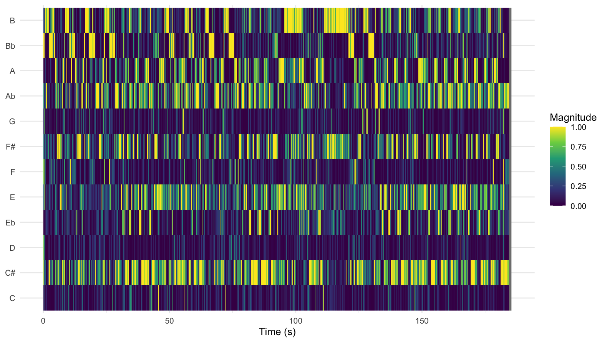
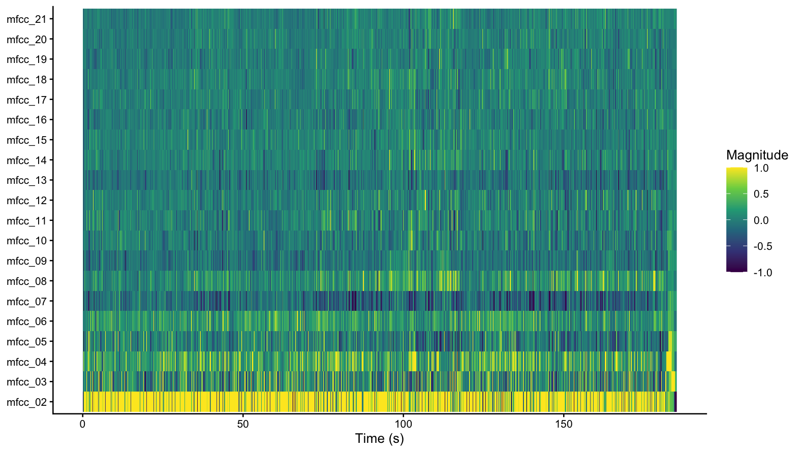
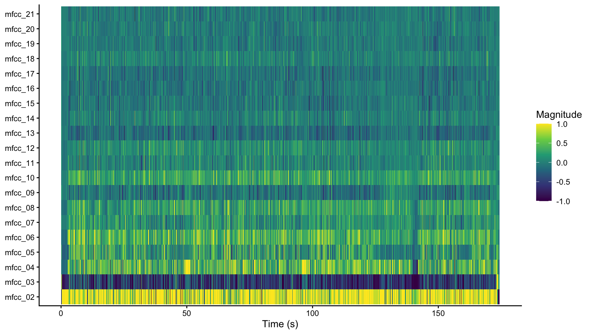
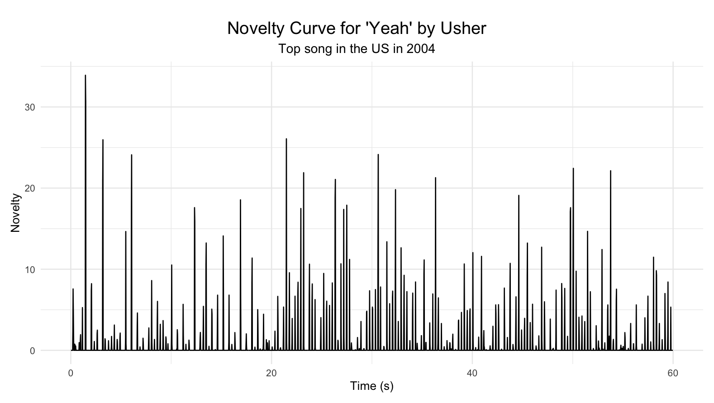
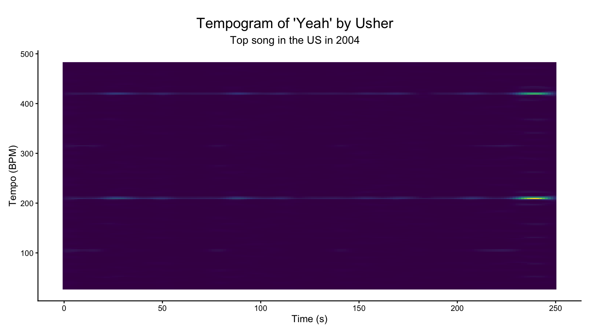
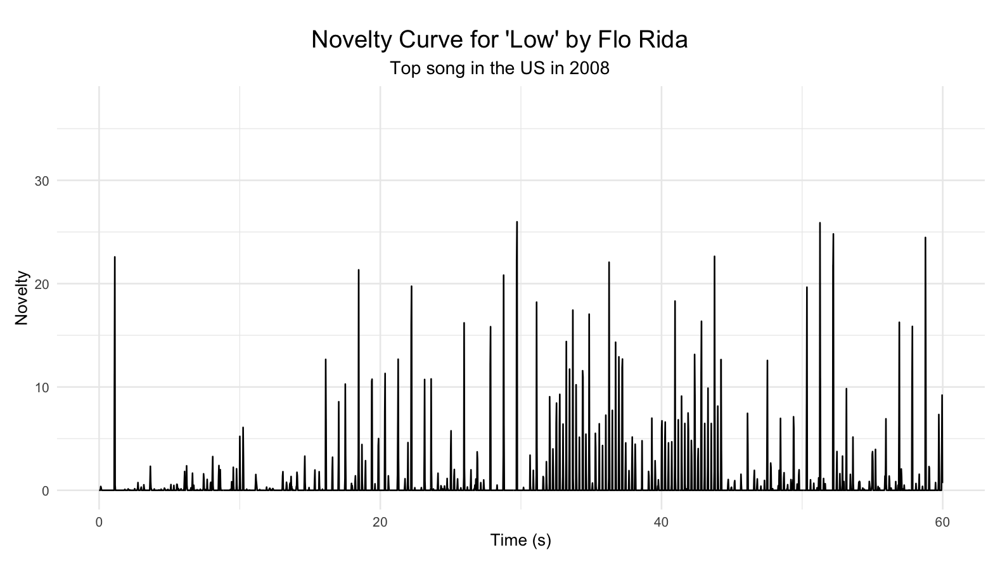
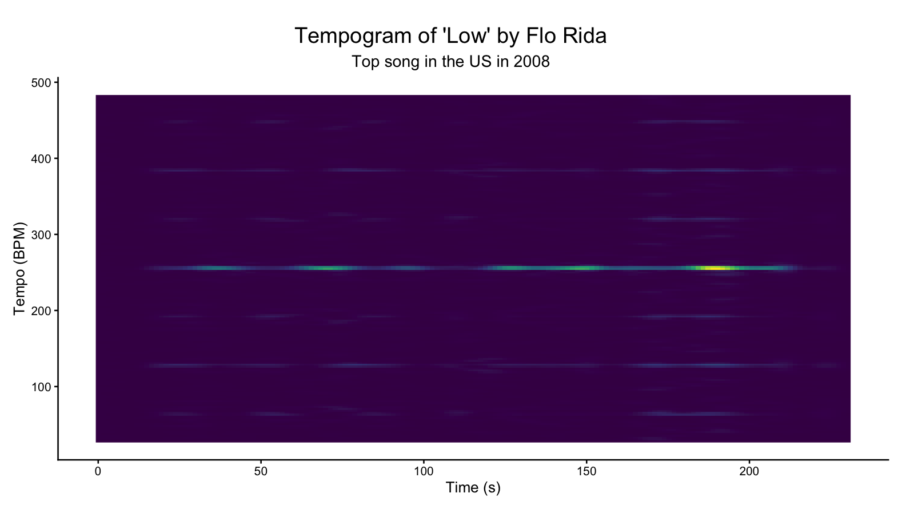

## Row

# Corpus

::: card
### Corpus

There are several ways economic prosperity is measured and predicted. From intuitive measures and mathematically complex models (unemployment, inflation, interest rates), to things like skirt length, lipstick sales and the "men's underwear index". I wanted to see if music could be a similar recession indicator. While you might think that people tend to listen to more melancholic and low-tempo music during economic turmoil, some quick research into "Recession pop" suggests the opposite. Smart (2025) describes it as "art which is thought to exalt in maximalism, high energy, and optimism as a way of escaping the difficulties that lie outside the walls of the nightclub". Hanson (2014) similarly links the rise of electronic dance music in 2009-2011 to the global economic crisis. The corpus of music I would like to use to further research this is the top songs from 2004-2007 versus the top songs from 2008-2011.

Hanson, C. F. (2014). Pop Goes Utopia: An Examination of Utopianism in Recent Electronic Dance Pop. Utopian Studies, 25(2), 384–413.

Smart, N. (2025). Bret/BRAT. Critical Quarterly
:::

## Row

# A first look into the data

::: card

:::

::: card
Across most features, the distributions of the timeperiods overlaps a lot. This means there is no dramatic shift, but there are still some more subtle differences we can look at:

### Acousticness 
In terms of acousticness, we can see that both periods are skewed towards low values, with crisis-songs slightly more so. This means popular music in both periods is predominantly non-acoustic/electronic. The slightly lower concentration of crisis-music slightly supports the idea of more synthetic, escapist production styles in this period, but we will need more evidence to support this claim

### Danceability 
We see that crisis-music peaks higher than pre-crisis music when it comes to danceability. Furthermore, the distribution of danceability is more spread out in the pre-crisis-period. This means that crisis songs are more consistently danceable, suggesting that music may have become more club-oriented and rhythm-focused during the financial crisis.

### Energy
Energy levels are quite similar throughout both periods. The energy distribution shows a slight dip in the crisis period where pre-crisis songs peak, but they seem to average around the same point. In terms of energy, no strong conclusions can be held.

### Liveness
Both periods seem to be concentrated around low levels of liveness. Crisis-music has a slightly higher peak at the very low levels. This might mean that most songs are studio-produced and not live recordings, and crisis songs may be even more polished/produced. While this is not extremely informative, it is consistent with ...

### Loudness
Crisis songs seem to be slightly louder, which fits with the idea of a more intense listening experience.

### Speechiness
There is  a peak at the lower end for both periods, but crisis-music seems to have a significantly higher density at the lowest end of the speechiness-spectrum. This suggests that most songs are musical rather than spoken/rap-heavy, in both time-periods. 

### Tempo
We can see that pre-crisis music peaks around 100BPM, while  crisis-music peaks around 120-130BPM. This is also the BPM rate we've learned people are most comfortable with. On average, crisis songs are faster, providing direct evidence for more upbeat music during the crisis period.

### Valence
Pre-crisis music has a slightly higher peak, around 0.75, while crisis-music seems to have two peaks, round 0.5 and 0.77. This siggests crisis-songs are not clearly happier, possibly slightly less positive or more mixed emotionally.

While the distributions of Spotify features largely overlap across periods, several subtle shifts can be observed. Songs released during the financial crisis tend to be slightly more faster,louder, and more consistently danceable, while not showing a clear increase in valence. This suggests that rather than becoming more positive, crisis-era music may have become more intense and rhythm-driven, supporting the idea of “recession pop” as an escapist response to economic uncertainty.
:::

## Row

# Chromagrams & DTW

::: card
### Chromagrams & Dynamic Time Warping

Amy Winehouse — Tears Dry Own Their Own

Greenday — American Idiot

:::

::: card
To analyze harmonic content over time, chromagrams were computed for each track. A chromagram represents the intensity of the pitch classes at each moment in time, To compare different recordings, Dynamic Time Warping (DTW) was applied. DTW aligns two time series by "warping" them in time to find an optimal match between their chroma features.

As a case study, two versions of American Idiot by Green Day were compared: the original recording and the 20th anniversary rerecording (2024). The DTW alignment between these versions does not show a single strong diagonal line, which would indicate near-identical structure and timing. Instead, the alignment contains multiple shorter diagonal segments and symmetric patterns. This suggests that, while the songs share similar harmonic material, there are local timing differences and structural variations between the two versions.

This pattern is consistent with what can be heard in the recordings. The rerecorded version differs slightly in timing, energy, and production, which likely affects how the chroma features align. Additionally, American Idiot is built around a highly repetitive harmonic structure, most notably the recurring power-chord riff. This repetition is reflected in the DTW visualization as repeated diagonal fragments rather than one continuous line, because similar musical sections are matched multiple times across the two recordings.

Examining the chromagrams themselves further clarifies these differences. The chromagram of American Idiot shows strong, consistent activation in a limited set of pitch classes, indicating a relatively simple and repetitive harmonic structure. This aligns with the auditory impression of the song, which is driven by guitar power chords and has a direct, energetic sound.

In contrast, Tears Dry On Their Own by Amy Winehouse exhibits a more varied chromagram, with activity spread across a wider range of pitch classes and more fluctuation over time. This reflects a richer harmonic palette and more complex arrangement, which is also clearly audible through its layered instrumentation and soul-influenced style.

Overall, the chromagrams provide a clear visual representation of the musical differences between the tracks: American Idiot appears more harmonically constrained and repetitive, while Tears Dry On Their Own shows greater harmonic diversity and variation. These visual patterns closely correspond to the perceptual differences between the songs.
:::

## Row

# Cepstograms

::: card
### Amy Winehouse — Tears Dry Own Their Own

:::

::: card
The cepstrograms provide insight into the timbral structure of the tracks over time. In American Idiot, a clear dark band is visible in one of the lowest MFCC coefficients, indicating that the overall spectral balance remains highly stable throughout the track. This suggests a consistent timbre, which matches what is heard: the song is dominated by distorted guitar and drums, resulting in a uniform and steady sound. This consistency is also visible in the relatively stable horizontal patterns across other coefficients. You can clearly hear this in the song, which maintains a constant, driving character with little variation in sound color.

In contrast, Tears Dry On Their Own shows more variation across MFCC coefficients over time, visible as stronger fluctuations in the cepstrogram. This indicates a more dynamic and complex timbre, likely due to its richer instrumentation and arrangement. This is also audible, as the track contains more variation in texture and sound throughout.
:::

::: card
### Greenday — American Idiot

:::

## Row

# Tempograms

::: card
### 2004

 
:::

::: card

The novelty curves visualize how much the musical signal changes over time. In this case, only the first minute of the song is analyzed, so not too many details are lost but a significant portion of the song is still visualized. Peaks in the curve indicate moments where the audio features differ strongly from the preceding segment.

In the novelty curve of *Yeah!* by Usher (2004), the peaks are relatively spread out across the song. This suggests that the track contains clearer structural transitions, such as changes between verse, chorus, and other sections. When listening to the song, this pattern can also be heard clearly. The track opens with a relatively sparse introduction built around a recognizable synthesizer motif and a steady beat. There is not much change in this pattern throughout the song, with is why the novelty curve looks quite steady.

By contrast, the novelty curve of *Low* by Flo Rida (2008) shows many more peaks occurring close together, and then further apart again. This indicates more frequent changes in the song. This pattern can also be heard in the music itself. The opening of *Low* quickly introduces a layered instrumental texture with multiple percussive elements, bass hits, and electronic sounds. Around 30 seconds into the song, the beat is "doubled" halfway through the chorus, before being "halved" again after the chorus. This is also clearly visible in the novelty curve.

The tempograms provide additional insight into the rhythmic structure of the songs by visualizing the strength of periodicities at different tempo levels over time. In both tracks, a clear horizontal line can be observed, indicating a very stable underlying tempo throughout the song.

In *Yeah!*, the most prominent tempo band appears around roughly 200 BPM. However, this value likely does not represent the perceptual tempo of the track. Instead, it is probably a double-time representation of the underlying beat. A second line is clearly visible around 400 BPM, probably a quatruple-time representation. A similar pattern can be observed in *Low*, where a strong horizontal band appears around approximately 250 BPM. However, the tempogram of *Low* also shows several additional horizontal bands that are spaced at regular intervals. These probably reflects the change of the beat during the chorus.

These differences can also be heard when listening to the songs themselves. *Low* feels more upbeat and is clearly faster, which contributes to the "dance-ability" of the song.
:::

::: card
### 2008

 
:::

## Row

# Dendograms

::: card
 
:::

::: card
The dendrograms reveal a clear difference in the clustering structure between the two periods. The pre-crisis dendrogram (2004–2007) shows a strong split into two large clusters that only merge at a high distance, indicating substantial differences between groups of songs. This suggests a higher degree of diversity in the musical features during this period, with some tracks being relatively dissimilar from the rest.

In contrast, the crisis-period dendrogram (2008–2011) displays a more gradual and compact clustering structure, with many smaller clusters that merge at lower distances. This indicates that songs in this period are more similar to each other in terms of their extracted features.

:::

::: card
 
:::

## Row 

# Conclusion

::: card
This analysis set out to explore whether popular music reflects economic conditions, specifically whether the financial crisis of 2008 is associated with measurable changes in musical characteristics. While the overall distributions of Spotify features show substantial overlap between the two periods, several consistent patterns emerge across different representations.

Crisis-period music appears to be slightly faster, louder, and more consistently danceable, without showing a clear increase in valence. This suggests that rather than becoming more positive, music became more rhythm-driven and energetic. The novelty curves and tempograms further support this, showing denser activity and strong, stable rhythmic structures that contribute to a more “club-oriented” sound.

At a more structural level, the dendrograms and clustered heatmaps indicate a shift towards greater similarity between songs during the crisis period. Compared to the pre-crisis period, where clearer separations between groups of songs are visible, crisis-era music appears more homogeneous in its feature space. This is reinforced by the cepstrogram and chromagram analyses, which highlight more consistent timbral and harmonic patterns in certain tracks.

These findings align with the idea of “recession pop” as described in the literature: rather than reflecting economic hardship through more melancholic or subdued music, popular songs during the crisis seem to emphasize energy, repetition, and escapism. This is also perceptually noticeable when listening to the tracks, where crisis-period music often shares a polished, upbeat, and rhythm-focused character.

Overall, while the differences are subtle rather than dramatic, the combination of feature-based analysis and audio representations suggests a meaningful shift in popular music during the financial crisis towards greater uniformity and increased emphasis on danceability and intensity.
:::
